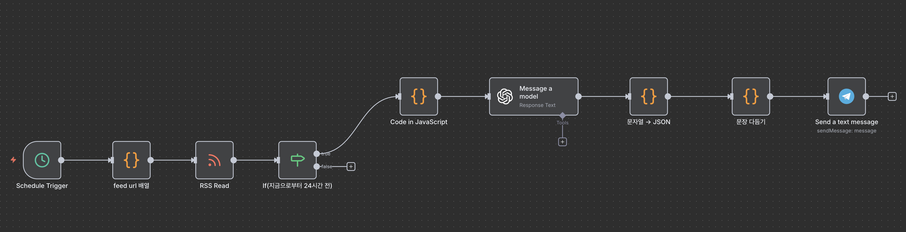

# Telegram-Tech-News-Daily

매일 Tech 뉴스들을 RSS로 가져와 AI가 판단해 중요한 뉴스들을 선별하여 텔레그램 채널로 알려줍니다.

## 기능

- 여러 Tech RSS를 주기적으로 읽어오기
- GPT 요약으로 중요한 소식만 추리기
- 텔레그램 채널로 전달

## 간단 사용법

1. n8n에서 `Telegram-Tech-News-Daily.json` 워크플로우를 Import합니다.
2. Telegram Bot 토큰과 Chat ID, OpenAI API 키를 Credential에 입력합니다.
3. RSS 노드에 원하는 피드를 추가한 후 워크플로우를 활성화하면 자동으로 뉴스가 전송됩니다.
